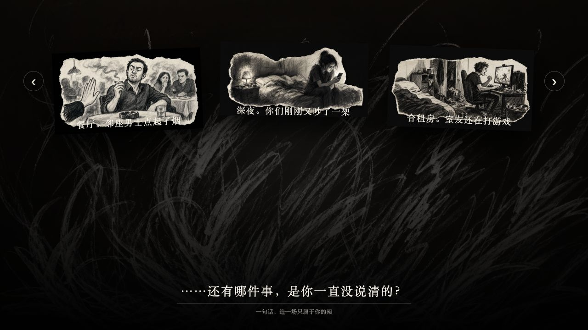
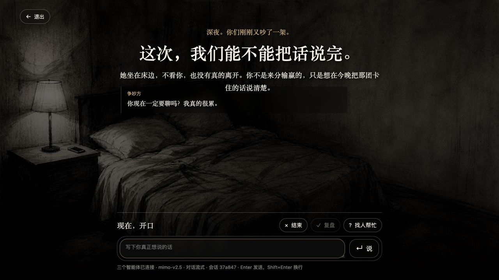
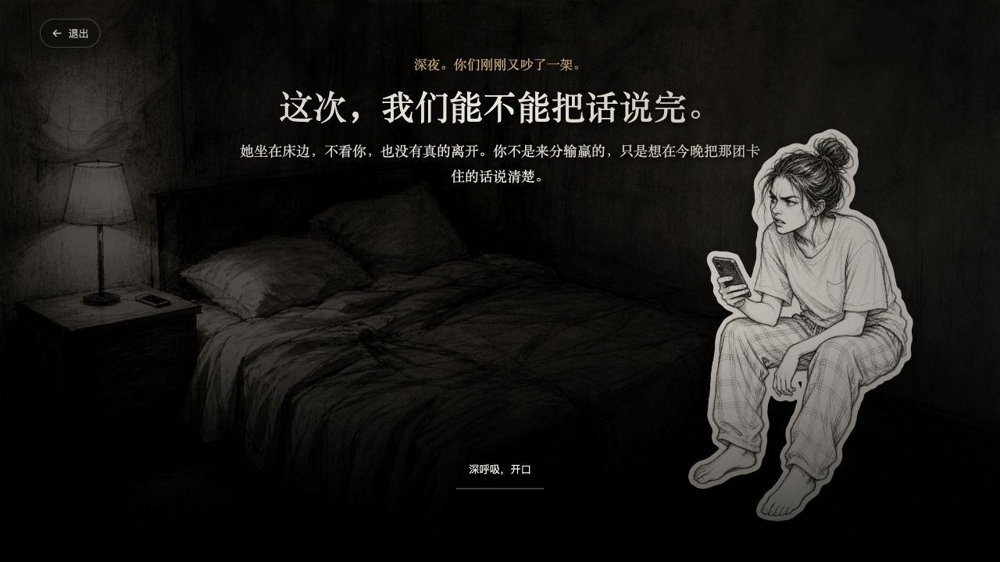

# Argument Practice Room

[简体中文](README.md) | English

An AI-powered web prototype for practicing communication during conflict. It is not an “insult generator,” but a training room for expressing yourself in difficult conversations. Choose or generate a conflict scenario, talk with an AI opponent over multiple turns, ask an AI coach for help when needed, and receive a post-session review of your communication process and tendencies.

The project is currently in active foundational development, with a focus on validating its interaction design, multi-agent architecture, scenario generation, and persistent multi-session support.

## Interface Preview

### Scenario Selection



### Training Conversation



### Immersive Mode



## Tech Stack

- Frontend: vanilla HTML, CSS, and JavaScript
- Backend: Node.js native `http` server
- Database: SQLite persistence through Node.js built-in `node:sqlite`, covering sessions, messages, reviews, and scenario-generation jobs
- AI chat: OpenAI Chat Completions-compatible endpoints
- AI images: `/images/generations` endpoints compatible with the OpenAI Images API style
- Speech recognition: local `whisper.cpp` or an OpenAI Audio Transcriptions-compatible endpoint
- Text to speech: an OpenAI Audio Speech-compatible endpoint or the Xiaomi MiMo Chat audio protocol
- Streaming: the server calls chat models with `stream: true`, while the frontend renders incoming content incrementally
- Local cache: `sessionStorage` stores the current tab's session, and `localStorage` stores scenarios created locally by the user

Node.js `22.5` or later is required.

## Quick Start

```bash
npm start
```

Open:

```text
http://127.0.0.1:4173
```

Admin configuration:

```text
http://127.0.0.1:4173/admin.html
```

The initial admin access code is `admin`. Configuration is stored in `data/config.json`. This file may contain API keys, is ignored by `.gitignore`, and must not be committed to GitHub.

## Model Configuration

The admin page supports OpenAI-compatible model providers and the following settings:

- Chat endpoint: a root URL, a `/v1` URL, or a complete `/chat/completions` URL
- Chat model name
- Chat API key
- Image endpoint: a root URL, a `/v1` URL, or complete `/images/generations` and `/images/edits` URLs; the provider must support both image generation and image editing
- Image model name
- Image API key
- Image-generation timeout
- Speech-recognition mode, endpoint, model, API key, and timeout
- Speech-synthesis endpoint, model, voice, format, API key, and timeout

Most OpenAI-compatible providers can be connected with a `base_url`, model name, and API key. The admin page tests chat and image services separately, making provider issues easier to diagnose.

## How It Works

1. The user chooses a scenario on the home page, then selects Training Mode or Immersive Mode.
2. When creating a new scenario, the frontend creates a persistent generation job and subscribes to its progress through SSE.
3. The text model turns the user's description and selected opponent gender into a title, three intro lines, the opponent's opening message, prompts for four agents, a win condition, and three image prompts.
4. The image model first uses `thumbnailArtPrompt` to generate a visual master containing the complete environment and opponent. That image is used directly as the home-page card. It is then edited with `artPrompt` to derive an immersive background without the person, and with `opponentArtPrompt` to derive the same character separately. The server appends a fixed `#00ff00` green-screen constraint to the character-edit prompt, then removes the background to produce a transparent PNG. Each of the three steps is attempted at most twice.
5. The server first writes text and images to a staging directory under `data/staging/`, validates the complete package, and atomically publishes it to `scene-configs/generated/<sceneId>/`.
6. The scenario page creates an anonymous practice session. Sessions, messages, and reviews are persisted in SQLite.
7. During a conversation, the server reads trusted context from the database and streams the opponent agent's response.
8. When the user enables “Ask for Help,” the AI coach uses an independent context and does not contaminate the opponent's context.
9. At the end of every turn in Immersive Mode, the referee reads only the current session and new turns, determines whether the communication objective has been met, and persists the verdict.
10. Once the objective is met, the page displays the communication outcome and an immediate emotional-state summary, then lets the user decide whether to generate a review.
11. When the practice ends, the review analyst reads the argument and coach suggestions, then produces a process analysis, scores, communication tendencies, and next-step recommendations.
12. Immersive Mode reads the opponent's opening line aloud, then loops through browser recording, speech recognition, streamed opponent response, referee evaluation, and speech playback. The help coach is unavailable in this mode.

## Implemented Features

- Three built-in scenarios: family boundaries, restaurant smoke, and a late-night confrontation
- A dedicated URL for every scenario, such as `/scene/phone-night`
- One-sentence custom scenario generation
- SSE generation-progress updates with polling fallback
- Atomic scenario publishing so failed jobs never expose incomplete output
- OpenAI Chat Completions-compatible chat model configuration
- OpenAI Images API-style image model configuration
- Separate chat and image model tests
- Four decoupled agents: opponent, help coach, referee, and review analyst
- Streamed chat responses
- Anonymous multi-user session isolation
- SQLite persistence for sessions, complete messages, turn states, reviews, and generation jobs
- Shareable replay links containing both text and audio after the communication objective is met
- Per-session request locks that prevent concurrent writes from interleaving
- A `turns` state model covering pending, streaming, completed, and failed states, so retries do not leave partial turns behind
- Local history for user-created scenarios, with up to three recent entries on the home page
- Enter to send and Shift+Enter for a new line
- Training Mode and voice-based Immersive Mode for every scenario
- Automatic playback of the opening line in Immersive Mode, followed by turn-by-turn recording, recognition, response, and playback
- Turn-by-turn referee evaluation in Immersive Mode, with an outcome summary, immediate emotional state, and review entry point after success
- Switchable local `whisper.cpp` and OpenAI-compatible speech recognition
- Separate speech-recognition and speech-synthesis tests
- Low-latency MiMo TTS playback using `stream:true` and `pcm16`, with full-audio fallback on failure
- Server-side logging for admin and model errors without logging API keys
- `.gitignore` coverage for runtime data, secrets, databases, and user-generated scenarios

## Multi-Agent Design

The project separates four agent responsibilities. Training Mode uses the opponent, help coach, and review analyst. Immersive Mode uses the opponent, referee, and review analyst.

- Opponent: stays in character as the other person in the current scenario, advances the conflict, and never provides coaching or retrospective analysis.
- Help coach: joins only when the user selects “Ask for Help,” offering a next-step strategy and one sentence the user can say directly.
- Referee: checks whether the opponent has genuinely accepted a boundary or committed to action. It does not treat insults, domination, evasion, or silence as a win, and cautiously estimates the user's immediate emotional state.
- Review analyst: analyzes only the conversation that actually occurred and returns a structured review and communication tendencies.

The “personality analysis” in the review describes only the communication tendencies visible in that specific text exercise. It is not a psychological diagnosis or a fixed personality judgment. The server verifies that evidence quoted by the model comes from the user's actual words. If the citations are invalid, the model is asked to retry; if they remain invalid, the server repairs the output using real user text or falls back to reporting insufficient evidence.

## Local Speech Recognition

The project uses the official `whisper.cpp` `whisper-server` for local recognition. Initial setup requires `git`, `cmake`, and network access:

```bash
npm run voice:setup
npm run voice:start
```

Then select “Local whisper.cpp” in the admin page, set the recognition endpoint to `http://127.0.0.1:8080/inference`, and click “Test Speech Recognition.” The multilingual `base` model is downloaded by default. Models and build artifacts are stored under `.local/` and are not committed to GitHub.

For a cloud provider, select “OpenAI-compatible endpoint” and enter the provider's root or `/v1` URL, model, and separate API key. The server calls `/audio/transcriptions` with multipart/form-data.

Standard OpenAI speech output uses the provider's `/audio/speech` endpoint. Xiaomi MiMo audio models require the “MiMo Chat audio protocol” option in the admin page: ASR uses `mimo-v2.5-asr`, while TTS uses `mimo-v2.5-tts`. The opponent's voice is fixed as the scenario's `opponentVoice` when the scenario is created. The defaults are `茉莉` for a female opponent and `白桦` for a male opponent. Both call `/chat/completions` and can reuse the chat API key. MiMo TTS prefers `stream:true` with `pcm16`, returning 24 kHz PCM16LE mono chunks that the browser plays incrementally with Web Audio. If streaming fails, it automatically falls back to the original complete-audio endpoint. If TTS has not been configured, the page temporarily uses the browser's built-in speech synthesis as a demo fallback.

## Data and Directories

```text
.
├── server.js                    # Compatibility entry point
├── src/
│   ├── bootstrap.js             # Startup entry point
│   ├── application.js           # Dependency composition root
│   ├── http/                    # Routes and HTTP adapters
│   ├── domain/                  # Session, turn, review, and scenario-generation use cases
│   ├── agents/                  # Opponent, coach, referee, and analyst
│   ├── providers/               # External chat, image, transcription, and speech services
│   ├── repositories/            # Narrow SQLite repositories
│   └── jobs/                    # Queue and scenario-generation worker
├── public/
│   ├── shared/                  # Cross-page styles and scenario history storage
│   ├── lobby/                   # Home page
│   ├── create/                  # Scenario creation
│   ├── scene/                   # Scenario practice
│   ├── replay/                  # Replay
│   └── admin/                   # Admin configuration
├── scene-configs/               # Built-in scenario configuration
├── assets/                      # Built-in scenario images
├── scripts/migrate-dev.js       # One-time development migration script
└── data/                        # Ignored local runtime data
```

See [`docs/architecture.md`](docs/architecture.md) for dependency directions and migration constraints.

Scenario configuration fields include:

- `title`, `kicker`, `intro`, and `introLines`
- `opponent`
- `opponentGender`: the opponent's gender, used in argument copy, character generation, and default voice selection; choosing “No preference” on the creation page lets the generated text determine male or female
- `opponentVoice`: the opponent's MiMo TTS voice, stored as a scenario attribute; defaults to `茉莉` for female and `白桦` for male
- `opponentPrompt`
- `coachPrompt`
- `analysisPrompt`
- `winCondition`: a scenario win condition that must be verifiable from the opponent's words or actions
- `refereePrompt`: scenario-specific concessions, boundaries, or action commitments for the referee to evaluate
- `art`, `thumbnailArt`, and `opponentArt`
- `artPrompt`, `thumbnailArtPrompt`, and `opponentArtPrompt`: `thumbnailArtPrompt` defines the visual master, `artPrompt` removes the character to derive the immersive background, and `opponentArtPrompt` extracts the same character; green-screen and background-removal constraints are appended by the server

## Security Notes

The following content is never committed to the repository:

- `data/config.json`
- SQLite database files
- User session data
- Intermediate scenario-generation state
- User-generated scenario packages under `scene-configs/generated/`

If a screenshot, log, or terminal output exposes an API key, rotate it through the corresponding provider's dashboard.

## Development Migrations

The project does not retain compatibility branches for older prototype formats at runtime. Migrate old configuration or data structures with the one-time script:

```bash
npm run migrate
```

The migration handles legacy dual-role `systemPrompt` values, old `data/jobs/*.json` job records, and old `data/scenes/*.json` scenario configuration. After migration, the server reads only the current structures: `scene-configs/*.json`, `scene-configs/generated/*/scene.json`, and SQLite.

## Roadmap

- Add a production account system to replace anonymous session tokens
- Add a scenario gallery, favorites, sharing, and import/export
- Support separate model providers for each agent
- Add more granular safety policies and content moderation
- Upgrade SQLite to PostgreSQL for multi-instance deployment
- Move scenario-generation jobs to Redis or a dedicated queue
- Move generated images to object storage for multi-server deployments
- Expand automated and browser regression testing
- Build a more complete admin interface for scenario management, session management, and model-call statistics
